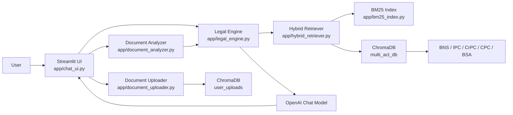
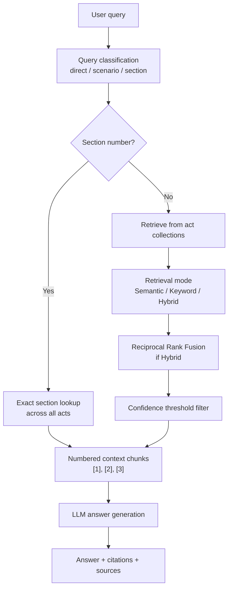
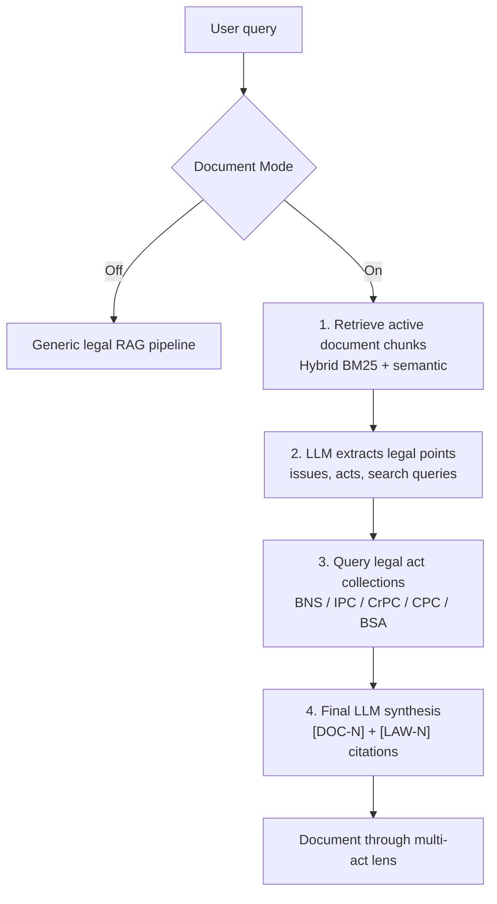
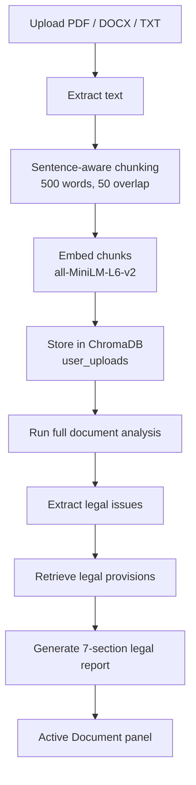

# Multi-Act Legal RAG Advisor

An AI-assisted legal research and document-analysis application built with Streamlit, ChromaDB, SentenceTransformers, BM25, and OpenAI. The system answers questions across multiple Indian legal acts and can analyze uploaded legal documents such as FIRs, contracts, bail applications, notices, and court orders through a multi-act legal lens.

> Disclaimer: This project is for legal information and academic demonstration only. It is not a substitute for advice from a qualified lawyer.

## Why This Project Matters

Most simple legal chatbots either answer from general model memory or retrieve a few chunks from one statute. This project is designed around a more realistic legal workflow:

- Users may ask questions across multiple acts, not just one code.
- Legal queries often require exact statutory keywords as well as semantic similarity.
- Uploaded documents should be treated as the subject of analysis, not merely as another competing retrieval source.
- Answers should be grounded with visible citations and source snippets.

The app supports two complementary modes:

| Mode | Use Case | Retrieval Behavior |
| --- | --- | --- |
| Generic Legal RAG | "Explain theft under BNS and IPC" | Queries BNS, IPC, CrPC, CPC, BSA, and optionally uploaded docs |
| Document Mode | "Analyze my uploaded FIR through applicable laws" | Retrieves active document chunks first, extracts legal points, then queries legal act collections |

## Core Features

- Multi-act coverage: BNS, IPC, CrPC, CPC, and BSA.
- Upload support for PDF, DOCX, and TXT files.
- Document-first analysis pipeline with a full legal report after upload.
- Explicit Document Mode toggle for analyzing an uploaded document through legal provisions.
- Hybrid retrieval using semantic search plus BM25 keyword search.
- Reciprocal Rank Fusion for combining semantic and keyword results.
- Confidence scores from ChromaDB distances and BM25 score normalization.
- Inline citations with source panels.
- Separate `[DOC-N]` citations for document facts and `[LAW-N]` citations for legal provisions in Document Mode.
- Debug panels for uploaded-document retrieval and document pipeline inspection.
- Export conversation as Markdown or JSON.

## System Architecture



## Runtime Pipelines

### 1. Generic Legal RAG Pipeline

Use this when the user asks a general legal question or statutory query.



### 2. Document Mode Pipeline

Document Mode is the important architectural distinction in this project. The uploaded file becomes the subject of analysis, while the legal acts become reference knowledge.



### 3. Upload and Initial Document Analysis



## Legal Coverage

The preloaded database is organized as separate ChromaDB collections:

| Act | Collection | Source Chunk File |
| --- | --- | --- |
| Bharatiya Nyaya Sanhita, 2023 | `bns_sections` | `data/bns_chunks.json` |
| Indian Penal Code, 1860 | `ipc_sections` | `data/ipc_chunks.json` |
| Code of Criminal Procedure | `crpc_sections` | `data/crpc_chunks.json` |
| Code of Civil Procedure | `cpc_sections` | `data/cpc_chunks.json` |
| Bharatiya Sakshya Adhiniyam | `bsa_sections` | `data/bsa_chunks.json` |
| User uploads | `user_uploads` | Created at runtime |

## Retrieval Design

The retrieval layer supports three modes from the sidebar:

| Retrieval Mode | What It Does | Best For |
| --- | --- | --- |
| Semantic only | Vector search over embeddings | Conceptual questions and paraphrased facts |
| Keyword only | BM25 lexical search | Exact phrases like "mens rea", "cognizable", "Section 302" |
| Hybrid (BM25 + Semantic) | Runs both and fuses results with RRF | Default mode for balanced legal retrieval |

Hybrid scoring uses Reciprocal Rank Fusion:

```text
RRF score = sum(1 / (rank_i + 60))
```

Semantic confidence is computed from ChromaDB cosine distance:

```text
confidence = 1 - cosine_distance
```

BM25 confidence is normalized against the top keyword score for the query.

## Citation Strategy

The app makes grounding visible in the UI.

Generic mode:

```text
Theft requires dishonest taking of movable property [1].
```

Document Mode:

```text
The uploaded FIR alleges that the accused caused injury during the incident [DOC-1].
That fact may require comparison with hurt or grievous hurt provisions under the relevant penal code [LAW-2].
```

Citation panels show:

- Act or uploaded-document label
- Section number or uploaded chunk id
- Heading
- Confidence badge
- Retrieved snippet

## Project Structure

```text
legal_rag_app/
├── app/
│   ├── chat_ui.py                 # Main Streamlit chat interface
│   ├── chat_app.py                # Thin/simple Streamlit page
│   ├── legal_engine.py            # Core RAG and document-mode orchestration
│   ├── document_analyzer.py       # Full uploaded-document legal report pipeline
│   ├── document_uploader.py       # PDF/DOCX/TXT loading, chunking, embedding
│   ├── hybrid_retriever.py        # Semantic, BM25, and RRF retrieval
│   ├── bm25_index.py              # Cached BM25 index builder
│   ├── multi_collection_manager.py# ChromaDB multi-act manager
│   ├── agent_router.py            # Query classification helpers
│   ├── scenario_processor.py      # Scenario-to-offense extraction
│   ├── retriever.py               # Older retrieval adapter
│   └── concept_expander.py        # Offense synonym expansion
├── data/
│   ├── bns_chunks.json
│   ├── ipc_chunks.json
│   ├── crpc_chunks.json
│   ├── cpc_chunks.json
│   └── bsa_chunks.json
├── scripts/
│   ├── embed_all_acts.py          # Builds multi_act_db from chunk files
│   ├── verify_multi_act.py
│   └── *_converter.py             # Source conversion helpers
├── multi_act_db/                  # Persistent ChromaDB vector store
├── .streamlit/config.toml         # Streamlit deployment config
├── .env.example
├── requirements.txt
└── README.md
```

## Quick Start

### 1. Create a virtual environment

```powershell
python -m venv venv
.\venv\Scripts\Activate.ps1
```

On macOS/Linux:

```bash
python -m venv venv
source venv/bin/activate
```

### 2. Install dependencies

```powershell
pip install -r requirements.txt
```

### 3. Configure environment variables

Copy the example file:

```powershell
Copy-Item .env.example .env
```

On macOS/Linux:

```bash
cp .env.example .env
```

Then add your OpenAI key:

```env
OPENAI_API_KEY=your_openai_api_key_here
OPENAI_MODEL=gpt-3.5-turbo-0125
```

### 4. Build or verify the ChromaDB legal database

If `multi_act_db/` is missing or empty, run:

```powershell
python scripts/embed_all_acts.py
```

This creates:

```text
multi_act_db/
├── bns_sections
├── ipc_sections
├── crpc_sections
├── cpc_sections
└── bsa_sections
```

### 5. Run the app

```powershell
streamlit run app/chat_ui.py
```

The default local URL is usually:

```text
http://localhost:8501
```

## How To Use

### Generic Legal Questions

Keep Document Mode off and ask:

```text
Explain theft under BNS and compare it with IPC.
```

```text
What is the evidentiary value of electronic records under BSA?
```

```text
What sections may apply if a person causes grievous hurt during a fight?
```

### Uploaded Document Analysis

1. Upload a PDF, DOCX, or TXT file.
2. Click `Index & Analyze`.
3. Review the Active Document panel in the sidebar.
4. Keep Document Mode on.
5. Ask document-focused questions:

```text
Summarize my uploaded document and identify the legal issues.
```

```text
Map the facts in my uploaded FIR to relevant BNS and IPC sections.
```

```text
What are the strengths and weaknesses in this bail application?
```

```text
What legal risks are visible in this contract?
```

## Suggested Demo Script

Use this sequence during an assignment demo or screen recording:

1. Start the app:

```powershell
streamlit run app/chat_ui.py
```

2. Ask a generic multi-act question:

```text
Explain theft under BNS and compare it with IPC.
```

3. Switch retrieval mode between `Semantic only`, `Keyword only`, and `Hybrid (BM25 + Semantic)` to show that retrieval is configurable.

4. Upload an anonymized sample FIR, contract, or legal notice.

5. Click `Index & Analyze`.

6. Show the Active Document panel:

- Severity
- Applicable acts
- Key legal issues
- Full legal report

7. Keep Document Mode on and ask:

```text
Map the facts in my uploaded document to relevant legal provisions.
```

8. Open the Sources panel and show `[DOC-N]` vs `[LAW-N]` citations.

9. Turn on debug mode and show the extracted legal points JSON.

## Sidebar Controls

| Control | Purpose |
| --- | --- |
| Document Mode | Routes queries through the document-first pipeline |
| Include my documents | Generic pipeline option for including uploads as retrieval sources |
| Retrieval mode | Choose Semantic, Keyword, or Hybrid retrieval |
| Confidence threshold | Filter weak retrieval results |
| Show retrieval context | Display raw retrieved snippets |
| Debug uploaded document retrieval | Show upload retrieval and document pipeline diagnostics |
| Export | Download chat history as Markdown or JSON |

## Repository Hygiene Before Submission

Before pushing to GitHub, make sure these are not committed:

```text
venv/
.env
__pycache__/
*.pyc
```

Recommended `.gitignore` entries:

```gitignore
venv/
.env
__pycache__/
*.pyc
.pytest_cache/
.DS_Store
```

The `multi_act_db/` directory can be committed for a ready-to-run demo if the repository host accepts the files. If not, omit it and run:

```powershell
python scripts/embed_all_acts.py
```

after cloning or deployment.

## Deployment

The recommended free deployment target is Streamlit Community Cloud because this is a Streamlit app with a long-running Python process.

### Recommended: Streamlit Community Cloud

1. Push the repository to GitHub.
2. Ensure `requirements.txt`, `.streamlit/config.toml`, and `app/chat_ui.py` are committed.
3. Deploy on Streamlit Community Cloud.
4. Set the main file path:

```text
app/chat_ui.py
```

5. Add secrets in the Streamlit dashboard:

```toml
OPENAI_API_KEY = "your_openai_api_key_here"
OPENAI_MODEL = "gpt-3.5-turbo-0125"
```

### Deployment Notes

- Do not commit `venv/`.
- Do not upload private or sensitive real legal documents to a public free demo.
- The current local `multi_act_db/` is roughly deployment-friendly in size, but if a hosting platform rejects binary DB files, rebuild it using `scripts/embed_all_acts.py` after deployment.
- Render or Railway can also run the app, but free tiers may sleep, limit credits, or require more setup.
- Vercel is not recommended for this project because Streamlit needs a long-running Python server, not a static/serverless frontend.

## Evaluation-Oriented Highlights

This project addresses common assignment evaluation criteria:

| Requirement | Implementation |
| --- | --- |
| Multi-act legal knowledge | Separate ChromaDB collections for BNS, IPC, CrPC, CPC, BSA |
| User document upload | PDF, DOCX, TXT ingestion into `user_uploads` |
| Grounded answers | Inline citations and source panels |
| Retrieval quality | Semantic, BM25, and Hybrid RRF retrieval |
| Document analysis | Document Mode pipeline treats upload as analysis subject |
| Transparency | Confidence badges, context preview, debug panels |
| Engineering structure | UI separated from logic in `legal_engine.py` and helper modules |
| Reproducibility | Requirements, `.env.example`, ingestion scripts, Streamlit config |

## Troubleshooting

### `No module named 'fitz'`

The uploader tries PyMuPDF first, but falls back to `pypdfium2` and `pdfplumber`. If all PDF extractors fail, install dependencies again:

```powershell
pip install -r requirements.txt
```

### Uploaded document is indexed but not used

Use Document Mode for document analysis. In generic mode, uploaded chunks are just optional retrieval sources. In Document Mode, the uploaded document is retrieved first and treated as the subject.

Also try:

- Lower confidence threshold to `0.30`.
- Use `Hybrid (BM25 + Semantic)`.
- Turn on `Debug uploaded document retrieval`.
- Ask using terms that appear in the uploaded document.

### Streamlit Cloud runs out of memory

The embedding model and ChromaDB can be heavy on free instances. Possible mitigations:

- Keep `multi_act_db/` compact.
- Avoid very large uploaded PDFs.
- Use fewer chunks per query.
- Consider Render/Railway or a paid instance for a more stable demo.

### OpenAI errors

Check:

- `OPENAI_API_KEY` is set.
- The key has available credits.
- `OPENAI_MODEL` is valid for your account.

## Key Design Decisions

### 1. Multi-collection ChromaDB

Each act is stored in its own collection. This keeps metadata clean, allows act-specific retrieval, and makes it easy to inspect which statute contributed to an answer.

### 2. Hybrid Retrieval

Legal questions often mix conceptual phrasing and exact statutory language. Semantic search helps with paraphrases; BM25 helps with exact terms and section references. RRF combines both without requiring a trained reranker.

### 3. Document Mode

Uploaded documents are not just another source competing with statutes. In Document Mode:

```text
uploaded document = subject
legal acts        = reference framework
```

This produces more useful outputs for FIRs, contracts, bail applications, and orders.

### 4. Visible Grounding

The app does not hide retrieval behind the final response. Citations, snippets, confidence badges, and debug panels are visible so users can inspect why an answer was produced.

## Known Limitations

- This is not legal advice.
- OCR is not implemented. Scanned PDFs must be OCR-processed before upload.
- Uploaded documents are stored in a shared local `user_uploads` collection; there is no production-grade user isolation.
- The LLM is prompted to cite carefully, but automatic citation faithfulness evaluation is not yet implemented.
- Free deployment platforms may sleep or have memory limits, especially because `torch`, `sentence-transformers`, and ChromaDB are relatively heavy.
- The app currently relies on OpenAI API availability for classification, scenario analysis, document issue extraction, and final synthesis.

## Future Improvements

- Add OCR for scanned PDFs.
- Add user/session isolation for uploaded documents.
- Add a test suite for retrieval recall and citation faithfulness.
- Add a cross-encoder reranker for improved legal relevance.
- Add Dockerfile and Docker Compose for self-hosted deployment.
- Add authentication before handling sensitive uploaded legal documents.
- Add an automated evaluation set with sample questions and expected citations.

## Safety and Privacy

Legal documents may contain sensitive personal information. For demos and assignment submissions:

- Use anonymized sample documents.
- Avoid uploading real FIRs, court records, medical records, addresses, IDs, or private contracts.
- Do not deploy with real user uploads unless authentication, access control, retention policies, and data deletion are implemented.

## Tech Stack

| Layer | Technology |
| --- | --- |
| UI | Streamlit |
| Vector DB | ChromaDB |
| Embeddings | `sentence-transformers/all-MiniLM-L6-v2` |
| Keyword Search | `rank-bm25` |
| LLM | OpenAI Chat Completions |
| PDF Parsing | PyMuPDF, pypdfium2, pdfplumber fallbacks |
| DOCX Parsing | python-docx |
| Data Processing | Python |

## Submission Checklist

- [ ] App runs locally with `streamlit run app/chat_ui.py`.
- [ ] `.env.example` is present and `.env` is not committed.
- [ ] README explains setup, architecture, usage, limitations, and deployment.
- [ ] Demo uses anonymized documents only.
- [ ] `requirements.txt` is committed.
- [ ] `multi_act_db/` is either committed or rebuild instructions are verified.
- [ ] Streamlit entrypoint is `app/chat_ui.py`.
- [ ] OpenAI API key is configured in local `.env` or deployment secrets.

## License / Academic Use

This repository is prepared as an academic assignment project. Verify the licensing of legal source data before public or commercial distribution.
